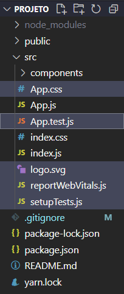
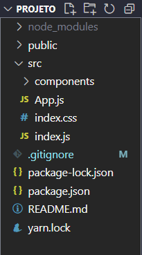
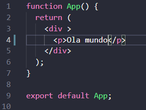
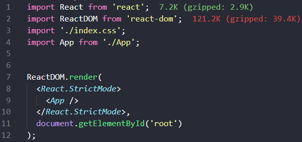

<h1>Preparando Ambiente</h1>

<h2>Primeiramente verificar se o Node está instalado:</h2>
<a href="https://nodejs.org/en/" style="color:white; font-size:20px">Link para o <u>NodeJs</u></a>

Abir uma pasta para ser a <b>Workspace</b>
    

        
Abrir a pasta com o <b>VS Code</b>

        <ol style="list-style: decimal-leading-zero;">No VSCode:
            <li>Abrir o terminal "<b>ctrl + shift + '</b> "</li>
            <li>No terminal, iniciar o Projeto react com <b>npx create-react-app nomeprojeto </b> </li>
            <li>Pelo terminal, entrar na pasta do projeto com <b>cd nomeprojeto</b> </li>
            <li>De preferecia, antes de iniciar o projeto no localhost, instale as dependencias que precisará pro projeto</li>
            <ul>Algumas dependencias <b>(opicional)</b>:
                <li><b>npm install json-server</b> (cria um backend "Fake", teste de api)</li>
                <li><b>npm install react-router-dom</b> (para criar rotas de navegação)</li>
                <li><b>npm install uuid</b> (cria ids como em bancos de dados)</li>
            </ul>
            <li>Inicie o projeto com <b>npm start</b></li>
        </ol>
        <h1>Limpando o projeto</h1>
        <h2 style="margin-bottom:1em">Excluir arquivos desnecessarios</h2>
        

            <h2>Antes: </h2>
            
            <h2>Depois:</h2>
            
        

        

            <h1>APP.JS</h1>
            <h2>Deixe o arquivo App.js somente com a função:</h2>
            
        

        

            <h1>index.js</h1>
            <h2>Apagar a importação reportwebvitals()</h2>
            
        

        <h1>Projeto preparado para ser codado ;)</h1>